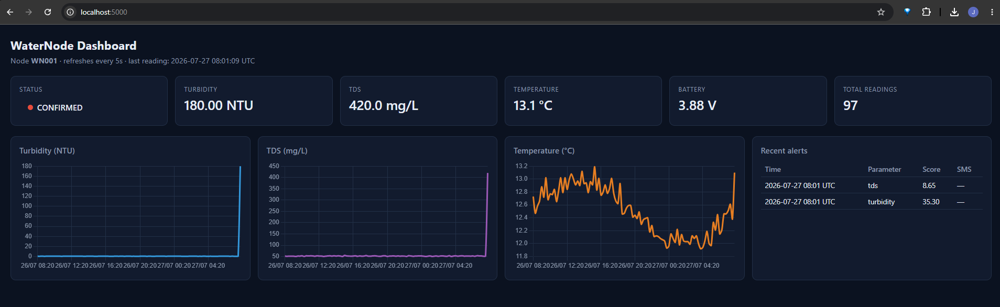
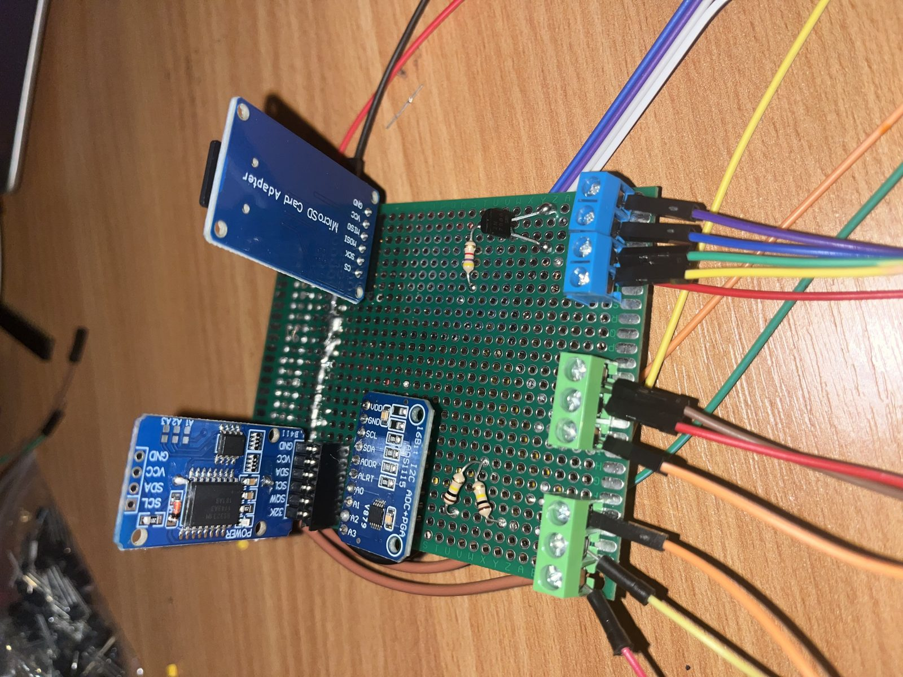
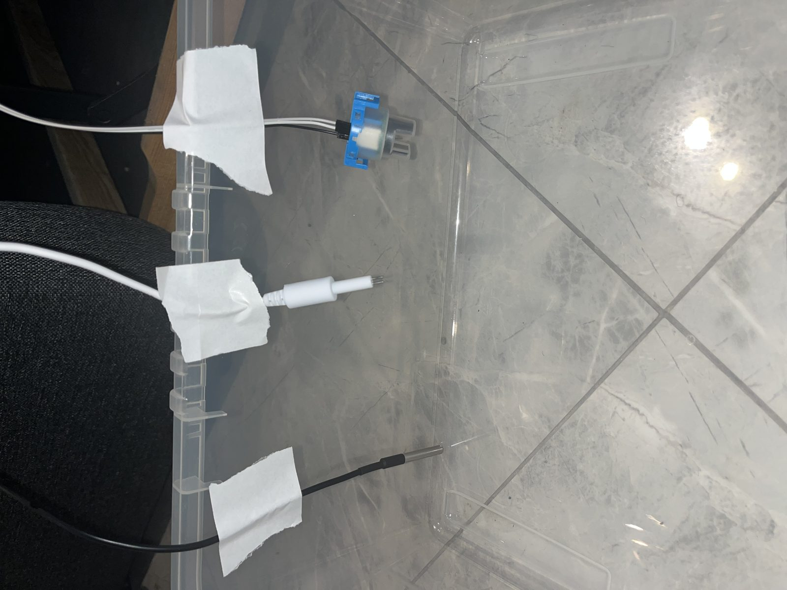

# WaterNode

[](https://github.com/JedidiahOla/Waternode/actions/workflows/tests.yml)

A low-cost water quality monitoring system built around a battery-powered
ESP32 sensor node and a Flask backend.

The node samples turbidity, TDS and temperature every 15 minutes, buffers to
an SD card, and uploads over GPRS every 4 hours. The backend runs CUSUM change
detection against a seasonal baseline and raises an SMS alert when a parameter
drifts consistently out of normal, rather than waiting for a single reading to
cross a fixed limit.

Final year Electronic & Computer Engineering project, Dublin City University.
Bench prototype, never field deployed. C++/Arduino firmware, Python backend,
92 tests.



## The problem

Contamination in a small rural water supply usually gets noticed when people
start getting sick. Continuous lab-grade monitoring exists but costs more than
the supply itself. The design question was how much useful early warning you
can get from roughly 60 EUR of parts, given no mains power, no reliable internet,
and nobody on site to maintain it.

Those three constraints drive most of the design. No mains power means deep
sleep between readings and a switched sensor rail. No reliable internet means
SD buffering, so an outage delays data instead of losing it, plus an SMS
failsafe that runs on the node itself when the backend is unreachable. No
maintenance means the node has to keep working with a dead sensor rather than
halting, which is why faults are a bitmask carried alongside every reading.

## How it fits together

```
 SENSOR NODE (ESP32, deep sleep between cycles)
 +-------------------------------------------------------+
 |  turbidity --+                                         |
 |  TDS --------+--> ADS1115 (I2C)    DS18B20 (OneWire)   |
 |              |                     DS3231 RTC (I2C)    |
 |              v                                         |
 |  wake -> sense -> local threshold check -> SD buffer   |
 |                          |               |             |
 |                     SMS (offline     every 4h, HTTP    |
 |                      failsafe)        POST via GPRS    |
 +--------------------------+---------------+-------------+
                            |               |
                            |               v
                            |    BACKEND (Flask + SQLite)
                            |    +-----------------------------+
                            |    |  validate -> store          |
                            |    |  CUSUM per parameter        |
                            |    |  Mahalanobis fusion         |
                            |    |                             |
                            |    |  NONE -> WATCH ->           |
                            |    |     WARNING -> CONFIRMED    |
                            |    |        |            |       |
                            |    |   Twilio SMS    dashboard   |
                            |    +--------+--------------------+
                            v             v
                            alert recipients
```

There are two detection paths by design. The node runs a crude absolute
threshold check locally so it can still raise an alarm with the network down.
The backend runs the actual statistics, where there is memory, floating point
and history to work with.

## Why CUSUM

A fixed threshold ("alert if turbidity > X") only catches a parameter that
jumps. It misses the case that matters most here: a supply degrading slowly
over days, where no individual reading looks alarming.

CUSUM (Page, 1954) accumulates small deviations instead of testing each
reading in isolation:

```
S+(t) = max(0, S+(t-1) + z(t) - k)
S-(t) = max(0, S-(t-1) - z(t) - k)
```

`k` absorbs sensor noise, so the accumulator only climbs once deviation is
consistent. An alarm fires when either accumulator crosses `h`. Twenty
consecutive readings 0.6 sigma above baseline will trip it; the same twenty
scattered either side of baseline won't.

A Mahalanobis distance across the valid parameters escalates faster when
several move together, since runoff after heavy rain raises turbidity and TDS
at once. The degrees of freedom follow however many sensors are healthy, so a
faulted sensor doesn't break the chi-squared threshold.

## Repository layout

```
firmware/     ESP32 firmware (C++/Arduino), sensing, buffering, GPRS, SMS
  waternode/          the firmware itself; open waternode.ino in Arduino IDE
  hardware-bringup/   standalone diagnostic sketches used during bring-up
  photos/             build photos of the assembled node

backend/      Flask + SQLite backend, detection, alerting, dashboard
  app.py              HTTP routes, request validation
  algorithm.py        CUSUM + Mahalanobis detection (pure functions)
  database.py         SQLite schema and queries
  seed_db.py          Generates 24h of synthetic baseline data
  demo_alert.py       Drives that data into a CONFIRMED alert
  tests/              pytest suite (92 tests)
```

Each half has its own README with the detail:
[firmware/README.md](firmware/README.md) and
[backend/README.md](backend/README.md).

## Quick start

The backend runs on its own, no hardware needed. It ships with a seeder that
generates 24 hours of synthetic readings so the dashboard has something to
draw:

```bash
cd backend
python3 -m venv .venv && source .venv/bin/activate
pip install -r requirements-dev.txt

cp .env.example .env
# set SECRET_KEY and API_KEY in .env, generate with:
#   python -c "import secrets; print(secrets.token_hex(32))"

python seed_db.py     # 24h of clean baseline data
python demo_alert.py  # push it into a CONFIRMED alert state
python app.py         # http://localhost:5000
```

`seed_db.py` on its own leaves the dashboard at `NONE`. `demo_alert.py` adds a
synthetic contamination event so you can see the detector actually fire. Both
print a reminder that the data isn't real.

```bash
pytest                # 92 tests
```

Twilio credentials are optional. Left blank, SMS sends are logged instead of
sent, so the whole alert path is exercisable without an account.

## Status

**Bench prototype. Built, wired and bench-tested in Dublin, never deployed to
a field site.** The hardware in `firmware/photos/` is real, and sensing, SD
buffering and the local alert path all work on it. The GPRS upload and SMS
path are written but untested against a live SIM800L, so treat those as
unproven. The firmware README covers how I would validate them.

What isn't production-ready:

- **Calibration is incomplete.** `TDS_KVALUE` is still 1.0 (uncalibrated) and
  the turbidity coefficients are DFRobot's published figures, not verified
  against bentonite standards on my unit. Relative change is meaningful,
  absolute NTU and mg/L aren't yet.
- **Only one row of the seasonal baseline table is real data.** The Dry-season
  row is measured from Dublin tap water. The other three are WHO/literature
  placeholders for the hypothetical deployment.
- **Auth is a single shared secret, over HTTP.** Fine for a controlled
  deployment behind a known URL, not for anything public. The SIM800L supports
  TLS; I didn't get to it.
- **One SQLite file, no replication.** Fine for one node, wrong past a handful.
- **Power consumption was never measured.** The design targets months on one
  18650 through a very low duty cycle, but nobody has put a meter on it, so
  battery life is an intention rather than a result.

The detection logic is the part I would defend. Calibration and deployment
hardening both need real field data before any absolute number coming out of
this should be trusted.

## Hardware

ESP32-WROOM-32, DFRobot SEN0189 turbidity sensor, DFRobot SEN0244 TDS sensor,
DS18B20 temperature probe, ADS1115 16-bit ADC, DS3231 RTC, SIM800L GSM/GPRS,
microSD, MT3608 boost converter, TP4056/DW01A charging, 18650 cell.

Roughly 60 EUR in parts. The full pin map is in the
[firmware README](firmware/README.md#pin-map).



*Perfboard build: ADS1115 and DS3231 on the shared I2C bus, microSD on VSPI,
screw terminals for the sensor leads.*



*Bench testing: turbidity, TDS and temperature probes in tap water while
taking the baseline measurements that became the Dry-season row of the
seasonal table.*

## References

- Page, E.S., "Continuous Inspection Schemes," *Biometrika*, 1954. CUSUM
- WHO *Guidelines for Drinking-Water Quality*, 4th ed., limits and baselines
- DFRobot application notes for SEN0189 and SEN0244, conversion formulas
- SIMCOM SIM800L Hardware Design Guide, power sequencing

## License

MIT. See [LICENSE](LICENSE).
